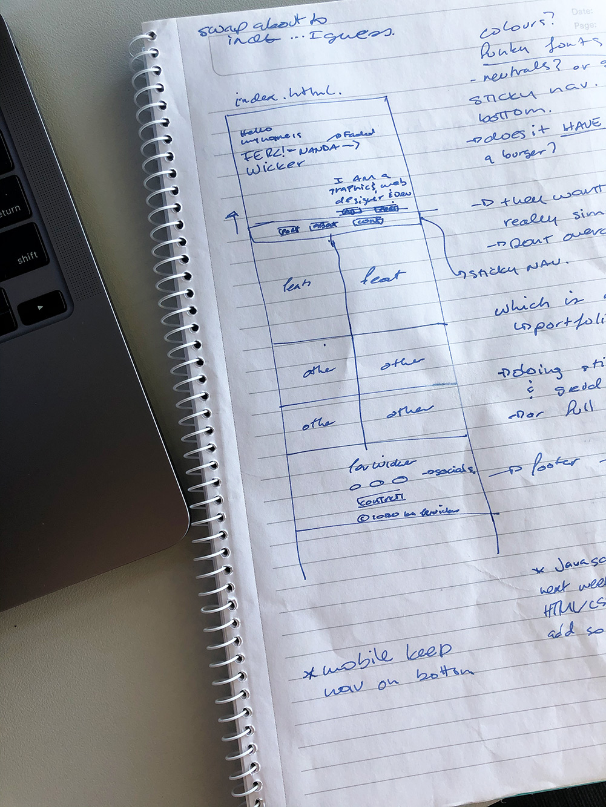
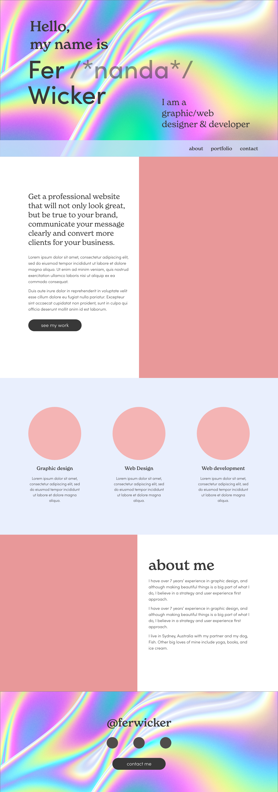

# Fer Wicker Responsive Portfolio
In this project I deigned adn developed a new rsponsive portfolio to showcase my work as a web designer and developer. The inspiration was summer and a bit of retro eclectic font styling. This project was developed using HTML and CSS with Bootstrap.

## Table of contents
  - [Table of contents](#table-of-contents)
  - [Motivation](#motivation)
  - [Process](#process)
  - [Features](#features)

## Motivation
Having a portfolio to showcase work is essential as a web deigner and developer as it is often the first place people will see your work not just in featured projects but in the portfolio site itself, it is also a great opportunity to prospective employers and clients to get to know some more about who you are as a person.

## Process
Every project starts with an idea. And no matter the many technological tools that are readilya available these days, pen and paper will always be the best when quickly sketching out the first drafts of a design. It doesn't need to be pretty, and in fact, is often just the opposite, but it is a great guide on how things might look, feel and interact with each other beyond what we can imagine.

With a sketch I am semi-comfortable with, I can begin to make a quick design mockup (my preferred tool for this is Adobe XD). This step is useful to set up the layout more clearly, and where the fun begins with images, fonts and colours. This is still not set in stone, and it is flexible enough for changes to be made during the developing process. 

Development was done using HTML and CSS with Bootstrap. For custom fonts I used Adobe Fonts, and Fontawesome for icons. This is where the real fun begins! Having a pretty good idea of what the final layour needs to look like and what I want to achieve gives the development a clear focus and structure to focus just on the code.

## Features
These days, with most of us researching and visiting websites anywhere on our phones, it is extremely important that our designs are scalable and responsive and look great on all screen sizes. Bootstrap helps make this easier with the grid system and by using media queries.

The final result for my portfolio website looks great on both desktop and mobile and is easy to read and navigate. The nav bar collapses on smaller screens into a hamburger menu. My favourite part is the footer, which is fixed to the bottom and hidden behind the page content using z-index values and gets revealed when we reach the bottom of the page.